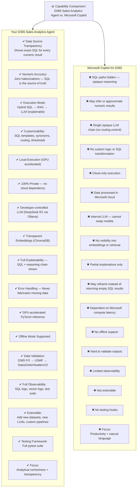

# 🚀 D365 Sales Analytics Agent  
### *Natural-Language Analytics & Knowledge Reasoning for Dynamics 365 F&O (Contoso – USMF)*

[]()
[]()
[]()
[]()
[]()
[]()
[]()
[]()
[]()
[]()

The **D365 Sales Analytics Agent** is a hybrid AI system capable of answering **natural-language questions** about **Dynamics 365 F&O Sales Orders**, combining:

- **Deterministic SQL analytics**  
- **Transformer-based embeddings + ChromaDB RAG**  
- **LLM-based reasoning (DeepSeek-R1 via Ollama)**  

All numeric results are guaranteed to come **only from SQL** — *never hallucinated*.

Built for **Contoso USMF** data (or your own exports), optimized for **GPU acceleration inside WSL 2**.

---

# 📊 Capability Comparison  
### *D365 Sales Analytics Agent vs. Microsoft Copilot (Infographic Style)*



---

# ⚙️ Environment & GPU Acceleration (WSL Recommended)

This project is intended to run inside **WSL 2 with GPU passthrough**, because:

- SentenceTransformers uses **PyTorch**, which performs **much faster with CUDA**
- GPU acceleration drastically speeds up embedding generation
- Ollama (DeepSeek-R1) also benefits from GPU inference
- Windows-native CUDA for PyTorch is inconsistent and not recommended

### ✔ Requirements
- **WSL 2** (Ubuntu 20.04 or 22.04)
- **NVIDIA GPU**
- **CUDA-enabled WSL drivers installed**  
- **Ollama installed (Windows or WSL)**
- **DeepSeek-R1 model pulled**

### Check GPU inside WSL:
```bash
nvidia-smi
```

### Install PyTorch with CUDA:
```bash
pip install torch torchvision --index-url https://download.pytorch.org/whl/cu121
```

### Install Ollama:
```bash
curl -fsSL https://ollama.com/install.sh | sh
```

### Pull DeepSeek-R1:
```bash
ollama pull deepseek-r1:8b
```

### Validate Ollama:
```bash
curl http://localhost:11434
```

⚡ When GPU is available:
- PyTorch → accelerates embeddings  
- DeepSeek-R1 → faster inference  
- SQL & ChromaDB → CPU-based as expected  

---

# 🌟 Features

### 🔹 SQL Analytics (Deterministic)
- SUM, COUNT, MIN, MAX, AVG  
- Group-by analytics  
- Thresholds + HAVING logic  
- Top-N detection  
- Synonym → column identification  
- SQL safety rules (SELECT-only)

### 🔹 RAG Reasoning
- Semantic search via ChromaDB  
- Schema explanations  
- Conceptual domain knowledge  
- Non-numeric reasoning

### 🔹 Hybrid Routing
Automatically determines whether a query requires:
- SQL  
- RAG  
- Combined hybrid mode  

### 🔹 Numeric Hallucination Prevention
- SQL is the **single source of truth**  
- LLM never fabricates values  
- If SQL returns no rows, the agent reports it explicitly  

---

# 🧠 System Architecture

```
      ┌────────────────────────┐
      │ Natural Language Query │
      └───────────────┬────────┘
                      ↓
            ┌───────────────────┐
            │  NLP → SQL Planner│
            └─────────┬─────────┘
                      ↓
    ┌─────────────────────────────────┐
    │ SQL Builder + Safety Validator  │
    └───────────────┬────────────────┘
                    ↓
            ┌──────────────────┐
            │ SQLite Analytics │  (Ground truth)
            └────────┬─────────┘
                     ↓
   ┌─────────────────────────────────────┐
   │ LLM (Ollama / DeepSeek R1)          │
   │ *Explains SQL only — no calculations!* │
   └─────────────────────────────────────┘

If SQL not applicable → ChromaDB RAG → LLM Explanation
```

---

# 📂 Project Structure

```
d365-sales-analytics-agent/
├─ app/
│  ├─ agent.py                  # Hybrid orchestrator
│  ├─ config.py                 # LLM + paths
│  ├─ embeddings.py             # Embedding generator (PyTorch)
│  ├─ llm.py                    # Ollama DeepSeek client
│  ├─ sql_store.py              # SQLite ingestion & safe executor
│  ├─ vector_store.py           # ChromaDB vector utilities
│  ├─ server.py                 # FastAPI (/ask)
│  ├─ ui.py                     # Streamlit interface
│  ├─ sql_engine/
│  │  ├─ column_mapper.py       # Synonym → column logic
│  │  ├─ planner.py             # NL → SQL planner
│  │  ├─ refiner.py             # SQL refinement
│  │  ├─ templates.py           # SQL templates
│  │  └─ validator.py           # SQL safety checks
│  └─ tests/
│     ├─ conftest.py
│     ├─ outputs.txt            # Test run output (pytest)
│     ├─ queries.json           # Evaluation prompts
│     ├─ test_agent.py
│     ├─ test_rag_mode.py
│     ├─ test_sql_generation.py
│     ├─ utils.py
│     └─ __init__.py
└─ data/
   └─ sales_orders.csv          # Contoso USMF dataset
```

---

# 🎛 Running the System

### Launch UI (Streamlit)
```bash
cd app
streamlit run ui.py
```

### Launch API (FastAPI)
```bash
cd app
uvicorn server:app --reload --port 8000
```

API Docs available at:  
📎 http://localhost:8000/docs

---

# 🔄 Using Your Own D365 F&O Data

1. Replace:
```
data/sales_orders.csv
```

2. Trigger refresh:
```json
{"refresh": true}
```

This rebuilds automatically:
- SQLite analytical DB  
- ChromaDB embeddings  

Optional: update `column_mapper.py` for company-specific naming.

---

# 🧪 Running Tests

Execute all tests:

```bash
cd app
pytest
```

Generates logs:

```
app/tests/outputs.txt
```

Tests validate:

- SQL generation  
- RAG retrieval  
- Hybrid routing  
- No numeric hallucinations  
- End-to-end correctness  

---

# 📄 Example Test Output (Excerpt)

```
QUESTION:
For each SalesOrderStatus, calculate number of orders and total contribution.

ANSWER:
- Backorder → 36 orders
- Delivered → 3 orders
- Invoiced → 708 orders
```

```
QUESTION:
For each month in 2024, compute export vs non-export orders.

ANSWER:
SQL returned no matching rows for your question.
```

```
QUESTION:
Show top 5 customers by total discounts where status = Invoiced.

ANSWER:
- US-004 → 25 orders
- US-006 → 25 orders
- US-011 → 25 orders
...
```

---

# ⚠️ Data Requirements

### ❗ Avoid USRT (Retail) demo company  
Contains **no monetary values**, resulting in empty analytics.

### ✔ Recommended Demo Companies
- USMF  
- DEMF  

### Minimum Required Columns
```
SalesOrderNumber
OrderingCustomerAccountNumber
OrderTotalAmount
SalesOrderStatus
```

---

# 🤖 Example Queries

### SQL-Driven
```
How many orders exceed 5000 USD?
Top 7 customers by average order total.
Customers with at least 80 orders and avg > 1900.
```

### RAG-Driven
```
Explain the meaning of SalesOrderStatus.
Describe the invoicing process in D365.
```

---

# 🛠 Installation (WSL + GPU)

```bash
curl -fsSL https://ollama.com/install.sh | sh
ollama pull deepseek-r1:8b

conda create -n d365 python=3.11 -y
conda activate d365

pip install torch torchvision --index-url https://download.pytorch.org/whl/cu121
pip install -r requirements.txt
```

---

# 📜 License  
Internal analytics tool. Not affiliated with Microsoft.
